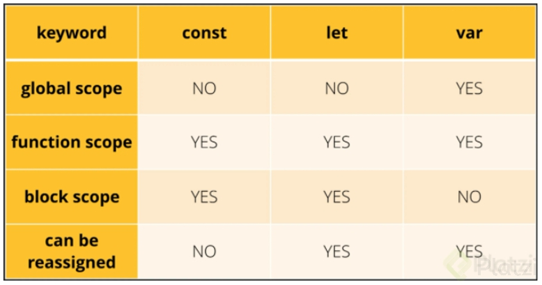

# Scope
Es el alcance que va a tener una variable dentro del código. En otras palabras, el Scope se encargará de decidir a que bloques de código va a acceder una variable.

## Global Scope
No están dentro de funciones o bloques, por lo tanto se puede acceder a ellas de manera global.

Con var podemos re-asignar una variable pero es una mala práctica.

Con let y const no podemos, aparecerá un error.

Es una mala práctica crear una variable sin las palabras reservadas: var, let y const.
Si se asigna una variable dentro de una función sin las palabras reservadas será una variable global.

La doble asignación de una variable también es una mala práctica.

## Local Scope
Se refiere a la variable o funcion que esta dentro de un bloque o funcion especifica. Solo se pueden acceder a ellas (ejecutar o llamar) dentro del entrono en donde conviven.

## Ambito lexico
El intérprete de JavaScript funciona desde el ámbito de ejecución actual y funciona hasta encontrar la variable en cuestión. Si la variable no se encuentra en ningún ámbito, se genera una excepción.

Este tipo de búsqueda se llama ámbito léxico. El alcance de una variable se define por su ubicación dentro del código fuente, y las funciones anidadas tienen acceso a las variables declaradas en su alcance externo. No importa de dónde se llame una función, o incluso cómo se llama, su alcance léxico depende solo de dónde se declaró la función.